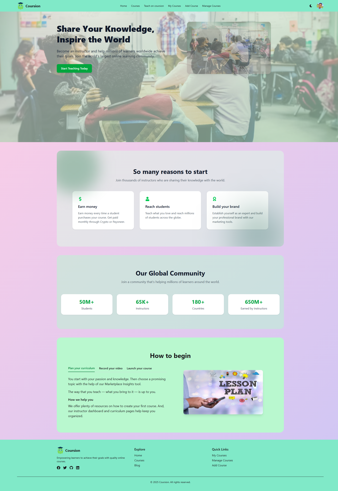

# 🎓 Coursion – Full Stack Online Course Platform

Coursion is a modern, full-stack online learning platform designed for scalability, performance, and a seamless user experience. Built with **React**, **Express**, **MongoDB**, and **Firebase**, it allows users to explore, purchase, and complete courses with ease.



A **full-stack online course marketplace** built with React 19 and serverless architecture, empowering instructors to create/share courses and students to discover/enroll in learning opportunities.

---

## 🌐 Live Deployment

<div align="center">

| Environment       | URL                                                                 | Technology Stack                     |
|-------------------|---------------------------------------------------------------------|---------------------------------------|
| Production Client | [coursion.web.app](https://coursion.web.app)                       | React 19 + Firebase Hosting          |
| Production API    | [api.coursion.app](https://coursion-server-eight.vercel.app)       | Node.js + Express + Vercel Functions |

</div>

---

## 🎯 Project Vision

**For Instructors:**
- 🏗️ Intuitive course creation wizard with rich content editing
- 📊 Real-time enrollment analytics dashboard  
- 💰 Flexible monetization options (coming soon)

**For Students:**
- 🔍 Advanced course discovery with AI recommendations (planned)
- 📱 Progressive Web App for offline learning
- 🏆 Achievement badges and learning pathways

**Technical Showcase:**
- ⚡ React 19 concurrent features
- 🔥 Serverless JAMstack architecture
- 🛡️ Enterprise-grade security practices

---

## 🛠️ Technology Stack

### Frontend Architecture


**Core Libraries:**
- **State Management**: React Context + useReducer
- **Animation**: Framer Motion 12.17.0
- **UI Components**: DaisyUI 4.4.0
- **Routing**: React Router 7.6.2
- **Forms**: React Hook Form + Zod validation

### Backend Services


**API Features:**
- RESTful endpoints with JWT authentication
- Rate limiting and request validation
- Serverless deployment on Vercel
- MongoDB Atlas with ACID transactions

### DevOps & Infrastructure


**CI/CD Pipeline:**
- Automated testing with Jest + React Testing Library
- Preview deployments for all PRs
- Monitoring with Sentry + Firebase Performance

---

## ✨ Key Features

### Course Management System
| Feature | Implementation Details |
|---------|------------------------|
| 🎥 Course Creation | Drag-and-drop syllabus builder with video upload |
| 📊 Real-time Seats | WebSocket integration for live enrollment updates |
| ⭐ Rating System | 5-star ratings with verified student reviews |
| 🔍 Advanced Search | Algolia-powered search with filters |

---

## 📂 Project Structure
```coursion/
├── client/ # React Frontend
│ ├── public/ # Static assets
│ ├── src/
│ │ ├── api/ # API service layer
│ │ ├── assets/ # Images, fonts
│ │ ├── components/ # Reusable UI
│ │ ├── contexts/ # Global state
│ │ ├── hooks/ # Custom hooks
│ │ ├── pages/ # Route components
│ │ └── utils/ # Helpers, config
│
├── server/ # Node.js Backend
│ ├── config/ # DB, auth setup
│ ├── controllers/ # Route handlers
│ ├── models/ # MongoDB schemas
│ ├── routes/ # Express routers
│ └── middleware/ # Auth, validation
│
├── .github/ # CI/CD workflows
├── docs/ # Project documentation
└── scripts/ # Deployment scripts
```


---

## 🚀 Getting Started

Follow these instructions to set up the project locally for development and testing.

### ✅ Prerequisites

Make sure you have the following installed:

- **Node.js** v20+
- **MongoDB Atlas** account (for cloud database)
- **Firebase Project** (for authentication)

---

## 🛠️ Installation

### 1. Clone the Repository (with Submodules)

```bash
git clone --recurse-submodules https://github.com/TonmoySarker-BD/coursion.git
cd coursion
```

### 2. Setup Client

```bash
cd client
npm install
cp .env.local
```

Add your Firebase credentials to `.env.local`:

```ini
VITE_apiKey=
VITE_authDomain=
VITE_projectId=
VITE_storageBucket=
VITE_messagingSenderId=
VITE_appId=
```

### 3. Setup Server

```bash
cd ../server
npm install
cp .env
```

Fill out the `.env` file with your MongoDB URI and other server-side secrets.

---

## 💻 Running the App (Development Mode)

From the root directory, run:

```bash
npm run dev --workspace=client
npm run dev --workspace=server
```

This will start both the frontend and backend in development mode.

---

## 🧩 Tech Stack

- **Frontend:** React + Vite + Firebase Auth
- **Backend:** Node.js + Express
- **Database:** MongoDB Atlas
- **Auth:** Firebase
- **Package Management:** npm + monorepo with workspaces

---

## 📈 Future Roadmap

### Q3 2025

- 📱 Mobile App (React Native)
- 💳 Payment Gateway Integration (SSLCommerz / Stripe)
- 🤖 AI-powered Course Recommendations

### Q4 2025

- 📜 Learning Path Certification
- 👥 Enterprise Team Accounts
- 📦 SCORM Compliance

---

## 🤝 Contributing

We welcome contributions! Please fork the repo and submit a pull request for any feature, bug fix, or improvement.

---

## 📬 Contact

For any queries or collaborations, reach out at: [tonmoycsebd@gmail.com]
